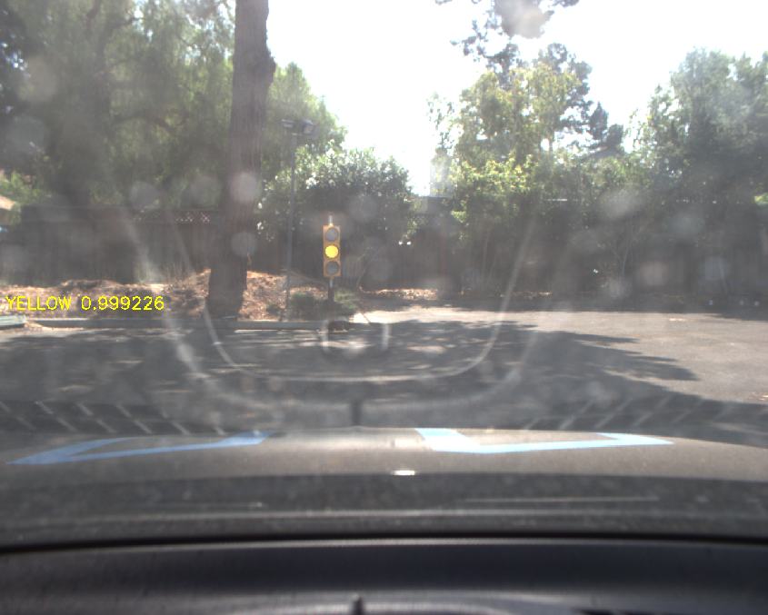
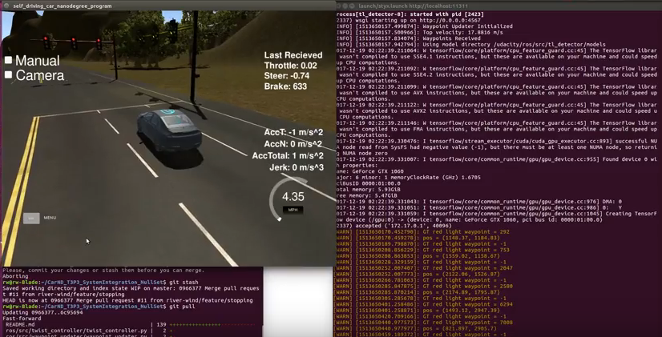
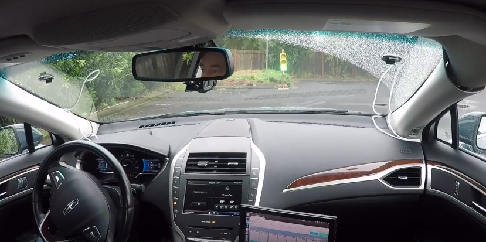

# Project: Capstone Project - System Integration
[](http://www.udacity.com/drive)

This is the project repository for Team NullSet's final project of the Udacity Self-Driving Car Nanodegree: Programming a Real Self-Driving Car. For more information about the project, see the project introduction [here](https://classroom.udacity.com/nanodegrees/nd013/parts/6047fe34-d93c-4f50-8336-b70ef10cb4b2/modules/e1a23b06-329a-4684-a717-ad476f0d8dff/lessons/462c933d-9f24-42d3-8bdc-a08a5fc866e4/concepts/5ab4b122-83e6-436d-850f-9f4d26627fd9).

## Team Members

|     Name      | Location | github | email |
|---------------|----------|----------|--------|
| Chris Lawrence | Dresher, PA | [https://github.com/river-wind/](https://github.com/river-wind/) | river_wind@mac.com |
| Liam Bowers | New York, NY | [https://github.com/liamondrop](https://github.com/liamondrop) | liamondrop@gmail.com |
| Scott Pillow | Sacramento, CA | [https://github.com/spillow](https://github.com/spillow) | scott.pillow@gmail.com |
| Eugen Nekhai | Minsk, Belarus | [https://github.com/eugenn](https://github.com/eugenn) | eugen.nekhai@gmail.com |
| Roman Kyslyi | Ukraine | [https://github.com/woters](https://github.com/woters) | kvrware@gmail.com |


## Scope and Purpose

This project is designed to both teach students about the Robot Operating System (ROS) used on Carla, the Udacity Lincoln sedan the project was tested on, and to allow the students to employ everything that has been covered during the Udacity Self Driving Car Nano Degree.  Each team member was assigned a portion of the project, and all worked together to integrate those subsections into a codebase which would run successfully on the Udacity simulator, and directly on Carla.

### ROS

The [Robot Operating System](http://www.ros.org/) is employed by many robotics projects in order to facilitate organized communication between discreet software subsystems such as those nessisary for an automated vehicle: perception, localization, prediction, and control.  In this project, we rely on ROS to pass structured data messages between task-specific "nodes", either streaming them to a "topic" and allowing other nodes to listen for those messages, or by creating a two-way communication via a "service".  

### Nodes 

Nodes are specific logical units which handle particular tasks.  In this project, many nodes are used to handle sensor input and the control of the vehicle.  As just a sample of the nodes involved, we used the tl\_detector node to identify stoplights in input video frames, the waypoint\_updater nodes to manage path planning, and the dbw and twist\_controller nodes to handle vehicle controls.

### Topics

Topics are one communication route for data to be sent between nodes.  A node publisher posts data to a "topic" which other nodes can subscribe to.  This communication is one-way, so there is no confirmation if a message has been received, much like the UDP internet protocol.

### Services

A service is similar to a topic, but involves a response back from the listener node.  Relying on a service rather than a topic depends on the requirements of the task at hand - if a message might trigger actions by other nodes and the original node does not need to know about that action, a topic can suffice.  Alternately, if a given message needs to trigger and action and provide a response back to the originating node, then a service would be used.


## Functional Project sections:

### Object and Traffic Light Detection

Relying on a pre-trained [SSD with Inception V2](https://arxiv.org/abs/1512.02325) Tensorflow neural network, the system classifies incoming visual data, first by whether it contains a traffic light or not, and then by whether that traffic light is currently Green, Yellow or Red.  When the light is Red, a message containing a waypoint array index is published to the /traffic\_waypoint topic. This in turn is used by the waypoint\_updater node uses to determine the a new waypoint list, which the twist controller relies on to manage the brake commands needed to stop the car prior to the intersection's stop line.



### Waypoint Finding

The waypoint finding subsystem relies on visual input to locate the desired best path for the car, including remaining on the road itself and not drifting into other lanes.  The waypoint\_updater node takes in a list of current desired path nodes, and keeps them up to date based on the new position of the car, and based on the appearance of any upcoming stoplights.

### DBW and Twist Controller

The DBW system handles the control output, and the Twist Controller node takes in messages from the waypoint\_updater to calculate the best throttle, brake and steering commands needed to reach the planned waypoints.  In addition to reaching to next waypoint, minimizing the rate of change in speed or direction is also critical, in order to provide a smooth ride to passengers.


## Results

### In Udacity Simulator


https://youtu.be/ZWlWcAqXWF4 A recording of the car successfully navigating the track with stoplights.

For training purposes, the Udacity Term 3 simulator is used as a stand-in for the real vehicle Carla.  As of this project's completion, the simulator included a 3 mile long virtual track and a virtual representation of the real-world gravel parking area where the real-world test on Carla will be performed. 

The project code is able to drive the Udacity virtual car around the simulator test track successfully at a range of speeds, identify red stop lights, and stop prior to the stop line when red lights are encountered.  The code is also able to drive Carla in the Site simulator mode, and is ready to be run on Carla in the real-world churchlot environment.

### On Carla

For the project's initial submition, the project code was tested on Carla and recorded as a ROSbag and a simple video.  The test video can be seen here:


https://youtu.be/zqPEY4eTgrw   Video of the project running on Carla in the rain


## Conclusion and Additional Thoughts

Relying on ROS to communicate asynchronously between ROS nodes allows for each portion of the car's logic pipeline to operate on incoming sesor or internal state data, so that each step in the process is not waiting for a prior step to complete.  Relying on video input for stoplight detection to potentially override the base control strucure we had built in our waypoint finding exercise is just one example of why this may be important.  From traffic lights, signs, traffic cones, other cars, pedestrians, etc, an autonomous vehicle planning system will need to take into account more than just lane lines and speed limits when driving on a real-world road.  

Accident avoidance would be one such requirement, and ROS's action node structure allows for inturrption and preemption, as we are demonstrating in a simpler form with the traffic light handling routine.  Using GPU-enabled Tensorflow and a SSD Inception v2 network to identify stoplights and classify lights into Red, Yellow, or Red, we can publish messages which the system can use plan its upcoming route.  This model seems to provide the flexibility and robustness needed to be used in a production system, and it would be interesting to know more about the use of ROS in real autonomous car projects.

This System Integration project could adopt a more general object detection method in place of the traffic light detection, one which allows for the classification of multiple object types in realtime.  Systems like [YOLO (You Only Look Once)](https://pjreddie.com/darknet/yolo/), [nvidia's DIGITS](https://devblogs.nvidia.com/parallelforall/detectnet-deep-neural-network-object-detection-digits/) and Apple's [BNNS](https://developer.apple.com/documentation/accelerate/bnns) and [CoreML](https://developer.apple.com/documentation/coreml) subsystem can allow for the classification of multiple object types with reasonable hardware requirements.  Careful comprehension of the entire scene surrounding an autonomous vehicle can allow for situational awareness through predictive modeling of likely behviors, improving vehicle behavior planning.  For example, trees will generally stay in place, and should be avoided.  Bicycles should also be avoided, but tend to move, and have riders who may chose to turn, and who may or may not provide hand signals before doing so.  Were we to add a complete object-recognition node to this project, we could then greatly improve the dynamic ability of the car to handle unexpected situations.


## Setup Prerequisites:

### System environment

To run this project yourself, either set up a native install or use Docker to create a docker container to work in.  Udacity has provided a VM image in case you are not running Linux natively, and also a Docker container for this purpose.  There is no GPU support under either option, however GPU-enabled docker containers for this project can be found online.

### VM Image

Udacity has made available a pre-configured VM image for use with Virtualbox.  You can find a link to the image on the project summary page in the Udacity classroom.  This is the quickest way to start this project - download the VM image and launch it from within Virtualbox per the provided instructions.

### Native Installation

* It is recommended that you use the provided Ubuntu VM image which already has ROS and Dataspeed DBW installed, but if you want to set up your own development environment natively, you can follow these steps to do so.

* Be sure that you are running Ubuntu 16.04 Xenial Xerus or Ubuntu 14.04 Trusty Tahir. [Ubuntu downloads can be found here](https://www.ubuntu.com/download/desktop).
* If using the provided Virtual Machine to install Ubuntu, use the following configuration as minimum:
  * 2 CPU
  * 2 GB system memory
  * 25 GB of free hard drive space

* Follow these instructions to install ROS
  * [ROS Kinetic](http://wiki.ros.org/kinetic/Installation/Ubuntu) if you have Ubuntu 16.04.
  * [ROS Indigo](http://wiki.ros.org/indigo/Installation/Ubuntu) if you have Ubuntu 14.04.
* [Dataspeed DBW](https://bitbucket.org/DataspeedInc/dbw_mkz_ros)
  * Use this option to install the SDK on a workstation that already has ROS installed: [One Line SDK Install (binary)](https://bitbucket.org/DataspeedInc/dbw_mkz_ros/src/81e63fcc335d7b64139d7482017d6a97b405e250/ROS_SETUP.md?fileviewer=file-view-default)
* Download the [Udacity Simulator](https://github.com/udacity/CarND-Capstone/releases/tag/v1.2).

### Docker Installation
[Install Docker](https://docs.docker.com/engine/installation/) and launch the Quickstart Terminal.

Build the docker container
```bash
docker build . -t capstone
```

Run the docker file
```bash
docker run -p 4567:4567 -v $PWD:/capstone -v /tmp/log:/root/.ros/ --rm -it capstone
```

## Usage

In any environment 

1. Clone the project repository  (this step may need to be run from the user's home directory)
```bash
git clone https://github.com/udacity/CarND-Capstone.git
```
2. Update pillow
```bash
apt-get remove pillow
apt-get install pillow
```
3. Install python dependencies
```bash
cd CarND-Capstone
pip install -r requirements.txt
```
4. Make and run styx
```bash
cd ros
catkin_make
source devel/setup.sh
roslaunch launch/styx.launch
```
5. Run the simulator in your host OS.  The Docker terminal should show that the simulator has connected.

## Real world testing

There is example output data from prior Carla test runs available for testing purposes via a "training bag".

1. Download [training bag](https://drive.google.com/file/d/0B2_h37bMVw3iYkdJTlRSUlJIamM/view?usp=sharing) that was recorded on the Udacity self-driving car (a bag demonstrating the correct predictions in autonomous mode can be found [here](https://drive.google.com/open?id=0B2_h37bMVw3iT0ZEdlF4N01QbHc))
2. Unzip the file
```bash
unzip traffic_light_bag_files.zip
```
3. Play the bag file
```bash
rosbag play -l traffic_light_bag_files/loop_with_traffic_light.bag
```
4. Launch your project in site mode
```bash
cd CarND-Capstone/ros
roslaunch launch/site.launch
```
5. Confirm that traffic light detection works on real life images, either by outputting log messages on succesfull identification, or by saving output images with rosimage.

Additional information about testing against RosBag data can be found here:
https://discussions.udacity.com/t/cant-find-the-rosbag-which-dbw-test-used-for-testing/
